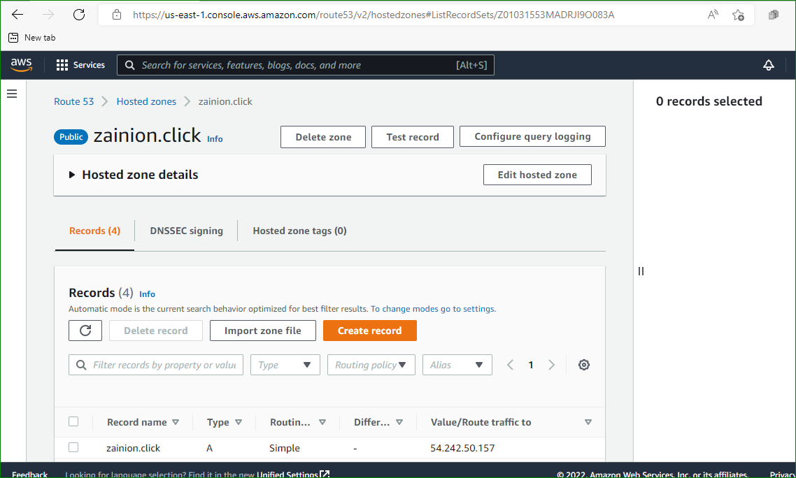

# LOAD BALANCER SOLUTION WITH NGINX AND SSL/TLS

For this project,I created a domain using AWS and I connected the public IP of my load balancer in the domain record.

`sudo apt update && sudo apt install nginx -y`

`sudo systemctl enable nginx && sudo systemctl start nginx`

`sudo systemctl status nginx`

Configure Nginx LB using Web Servers’ names defined in /etc/hosts

 `sudo vi /etc/nginx/sites-available/load_balancer.conf`

`sudo systemctl restart nginx`

`sudo systemctl status snapd`

`sudo snap install --classic certbot`

`sudo certbot --nginx -d zainion.click -d www.zainion.click`

`sudo ln -s /snap/bin/certbot /usr/bin/certbot`

`crontab -e`

